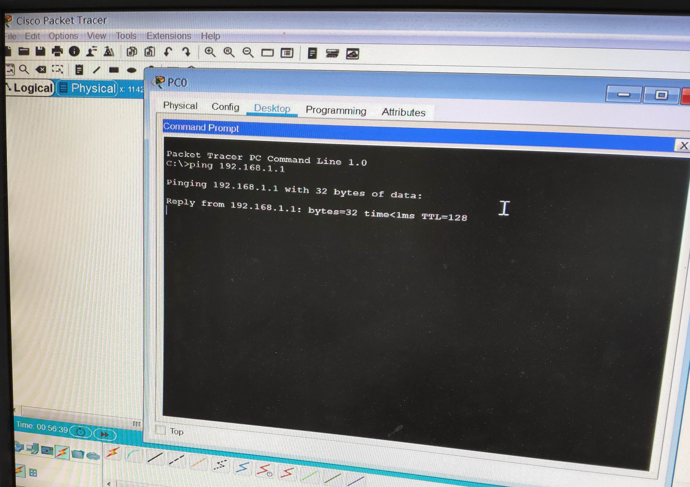

# 計算機網路筆記

## 參考來源：上課內容、上課影片、Jan Ho 的網絡世界

# 介紹 cisco packet tracer (9/10)

是一個模擬器可以模擬 cisco 的設備如 switch、router 等

### 安裝 cisco packet tracer

1. 首先到官方網站去下載Packet Tracer <br/>
<http://www.cisco.com/web/learning/netacad/course_catalog/PacketTracer.html>

2. 下載後依照安裝精靈開始安裝
<br/>


3. 安裝完成後啟動 Packet Tracer
<br/>


## 建置一個簡易網路環境

1. 依序點開 PC 設定檔
<br/>


2. 在 desktop 中選取 ip configuration
<br/>


3. 設定 ip address 以及 subnet mask，依序新增兩組 ip 為 192.168.1.1/24 及 192.168.1.2/24
<br/>


4. 點開其中一台虛擬 PC 在 desktop 中選擇 command prompt，測試 ping 另一台是否成功
<br/>


## router 設定

1. 新增拓樸如下
<br/>


```
Router(config)# hostname R1

R1(config)# interface fastEthernet 0/0
R1(config-if)# ip address 192.168.2.254 255.255.255.0
R1(config-if)# no shutdown
R1(config-if)# exit

R1(config)# int fa1/0
R1(config-if)#  ip address 192.168.1.254 255.255.255.0
R1(config-if)# no shut
R1(config-if)# ip interface brief
```

2. 輸入 ip interface brief 後得到的結果
<br/>


# 介紹線 (9/17)

### cisco console serial USB
Router 或 switch 都有一個 Console Port，下圖為 Console 線
<br/>


以下為示意圖


### 連線軟體

在 terminal configuration 中設定


使用 PuTTy，與 cisco packet tracer 內的 PC 進行連線

點選 Serial，並設定參數


### Cisco 密碼設定

建置兩台 router


之間用虛線連接，並右鍵開啟 FastEthernet0/0


設定登入特權(enable)模式密碼

設定明碼密碼為 cisco
```
(Config)#enable password cisco
```


取消登入特權(enable)模式密碼
```
(Config)#no enable password cisco
```


設定加密密碼為ccnp

```
(Config)#enable secret cisco
```


當明碼(password)和加密(secret)密碼兩者都有設定時優先使用secret之密碼
```
設定遠端登入(Virtual type terminal, vty)密碼

enable模式
(config)#line vty ?                    查看vty可連線數量(系統預設0-15)

(config)#line vty 0 4                  開啟0~4vty連線(即最大連線人數5人)

(config-line)#password ccna            設定密碼為ccna

(config-line)#login                    啟用密碼
```


# EVE-NG

到官網下載 OVA 檔<br/>
<https://www.eve-ng.net/index.php/download/>

使用 VMware 開啟


開啟瀏覽器輸入 EVE 指定的 IP，可看到以下登入畫面，並輸入預設帳號密碼登入


點選 new lab 新增檔案後，開啟，可看到空白作業環境，在左上點選加號，新增 Node


選取 cisco IOL 新增設備，加入兩個 nodes，image 使用 L3


將兩台設備連接，並開機，各別雙擊開啟終端機


R1 設定
```
Router>
Router> en
Router# conf t
Router(config)# hostname R1
R1(config)# interface e0/0
R1(config-if)# ip addr 12.1.1.1 255.255.255.0
R1(config-if)# no shut
```
R2 設定
```
Router>
Router> en
Router# conf t
Router(config)# hostname R2
R2(config)# interface e0/0
R2(config-if)# ip addr 12.1.1.2 255.255.255.0
R2(config-if)# no shut

R2(config-if)# do ping 12.1.1.1        測試是否連接
```

### tinylinux

進入下列網址，依照網頁步驟逐一完成

<https://www.eve-ng.net/index.php/documentation/howtos/howto-create-own-linux-host-image/>

點擊 Download Linux Images Here，下載tinylinux


使用 WinSCP 傳輸


步驟皆完成後，進入 EVE-NG 介面並新增節點，選擇Linux


選擇tinylinux


新增 switch 並將三個節點相連


開啟虛擬機的終端機，並加入位址與遮罩


```
su                                 第一台設定
ifconfig eth0 12.1.1.1 netmask 255.255.255.0
ifconfig                           查看設定
```

```
su                                 第二台設定
ifconfig eth0 12.1.1.2 netmask 255.255.255.0
ifconfig                           查看設定
ping 12.1.1.2
```


# 監聽 (9/24)

架設環境如下，一台switch、windows、kali linux、tiny linux

將三台虛擬機 ip 依序設為 192.168.1.1、192.168.1.2、192.168.1.3 ( ip addr add 192.168.1.xxx/24 brd + dev eth0 )

在 kali 中輸入 tcpdump -nni eth0 icmp

tcpdump 可用來擷取通過某網路介面的封包

-nn：直接以 IP 及 port number 顯示，而非主機名與服務名稱

-i：指令要監控的網路介面，如 eth0、lo、any 等

icmp：只抓取 icmp 的封包


# 路由器設定 (10/1)

```
en
conf t
hostname R1
int e0/0
ip addr 12.1.1.1 255.255.255.0
no shut
int lo 1
ip addr 1.1.1.1 255.255.255.255
do show ip int brief
以相同方式不同 IP 配置第二台

R1 > ping 12.1.1.2
.!!!!
第一封包為了執行 ARP 解析，所以第一個封包會被丟棄

show ip route 在路由器裡面看路由表

ping x.x.x.x repeat 數字   ( 重複ping '數字' 次 ) 

ping x.x.x.x source y.y.y.y   ( ping 來源 y.y.y.y )

ip route 1.1.1.1 255.255.255.255 12.1.1.1  ( 將第二台機器新增去第一台的路徑 )
```

Address Resolution Protocol ( ARP 位址解析協定 )

是一個通過解析網路層位址來找尋資料鏈路層位址的網路傳輸協定


### 三台路由器

預設路由（Default route），是對IP數據包中的目的地址找不到存在的其他路由時，路由器所選擇的路由。目的地不在路由器的路由表里的所有數據包都會使用預設路由

IPv4預設路由是0.0.0.0/0

```
ip route 0.0.0.0 0.0.0.0 13.1.1.3 ?     觀看可添加參數，預設值為 0
no ip route 0.0.0.0 0.0.0.0 13.1.1.3    取消路由設定

do show ip static route 0.0.0.0/0       觀看到某一位址的路徑有多少條，全數列出，此路由屬於靜態路由 

debug ip icmp                           觀測封包
```


Cisco Express Forwarding ( CEF 思科快遞交換)
CEF可以將 route lookup 的結果保存在 CEF Table，當 router 再次收到同一個 Destination 的 Packet 的話，不用再次尋找 route table


# RIP 協定 (10/8)

R1 設定如下
```
en
conf t
hostname R1
int e0/0
ip addr 10.1.1.1 255.255.255.0
no shut
exit
router rip
network 10.1.1.1
do show run
```

R2 設定如下
```
hostname R2 {
  interface Ethernet 0/0
  ip address 10.1.1.2 255.255.255.0
  interface Ethernet 0/1
  ip address 10.1.2.1 255.255.255.0
}
router rip
  version 2
  network 10.1.2.1
```

R3 設定如下
```
hostname R3 {
  interface Ethernet 0/0
  ip address 10.1.2.2 255.255.255.0

}
router rip
  version 2
  network 10.1.2.2
```


# Generic Routing Encapsulation (GRE) (10/22)

GRE 可以在兩個 Physical interface 之間建立點對點 Tunnel，多用於設置 Virtual Private Network(VPN) 去保護資訊

先建立以下拓樸


## 在 R1 R2 之間建立 tunnel
```
R1> int tunnel 12
R1> ip address 172.16.12.1 255.255.255.0
R1> tunnel source ethernet 1/0
R1> tunnel destionation 10.0.24.2
```
```
R2> int tunnel 12
R2> ip address 172.16.12.2 255.255.255.0
R2> tunnel source ethernet 1/0
R2> tunnel destionation 10.0.14.1
```

在 R1 R3 之間建立 tunnel
```
R1> int tunnel 13
R1> ip address 172.16.13.1 255.255.255.0
R1> tunnel source ethernet 1/0
R1> tunnel destionation 10.0.34.3
```
```
R2> int tunnel 13
R2> ip address 172.16.13.2 255.255.255.0
R2> tunnel source ethernet 1/0
R2> tunnel destionation 10.0.14.1
```
確認 R1、R2、R3 是否互相連通
```
R1> ping 172.16.12.2 source 172.16.12.1
R1> ping 172.16.13.3 source 172.16.12.1

R2> ping 172.16.13.3 source 172.16.12.2
R2> traceroute 172.16.13.3 route 172.16.12.2    traceroute 為從你的電腦到互聯網另一端的主機是走的什麼路徑，會發現路徑是 R2 > R1 > R3，因為是 Hub-to-spoke Topology
```
## Routing Protocol

利用 EIGRP 將 Router 背後的網路互相發布

```
R1> router eigrp 1
R1> network 172.16.12.0 0.0.0.255    0.0.0.255 為反掩碼
R1> network 172.16.13.0 0.0.0.255
R1> network 192.168.1.0
R1> no auto-summary                  

auto summary
這個命令的作用是關閉路由協議的自動匯總功能,主要是為了解決不連續子網互相訪問的問題,在這種情況下都會關閉自動匯總,而採用手工匯總的方式通告路由 

R2> router eigrp 1
R2> network 172.16.12.0 0.0.0.255    0.0.0.255 為反掩碼
R2> network 192.168.2.0
R2> no auto-summary                  


R3> router eigrp 1
R3> network 172.16.13.0 0.0.0.255    0.0.0.255 為反掩碼
R3> network 192.168.3.0
R3> no auto-summary  
```

查看 EIGRP 是否成功交換路由表
```
show ip route eigrp 1
traceroute 172.168.12.3 source 172.16.12.2
```


# IPSec (10/29)


```
R1 e0/0 為 192.168.10.1 255.255.255.0
   e0/1 為 192.168.13.1 255.255.255.0

ip route 0.0.0.0 0.0.0.0 192.168.13.3

ip access-list extended VPN-traffic
permit ip 192.168.10.0 0.0.0.255 192.168.20.0 0.0.0.255
```

```
R2 e0/0 為 192.168.20.1 255.255.255.0
   e0/1 為 192.168.23.2 255.255.255.0

ip route 0.0.0.0 0.0.0.0 192.168.23.3

ip access-list extended VPN-traffic
permit ip 192.168.20.0 0.0.0.255 192.168.10.0 0.0.0.255
```

```
R3 e0/0 為 192.168.13.3 255.255.255.0
   e0/1 為 192.168.23.3 255.255.255.0
```

```
R1> crypto isakmp policy 1
R1> encryption aes
R1> hash md5
R1> authentication pre-share
R1> group 2
R1> exit
R1> crypto ipsec transform-set TS esp-3des ah-sha-hmac
R1> exit
R1> crypto isakmp key 6 ccie address 192.168.23.2

R1> crypto map CMAP 1 ipsec-isakmp
R1> set peer 192.168.23.2
R1> set transforn-set TS
R1> match address VPN-Traffic
R1> exit
R1> int e0/0
R1> crypto map CMAP
```

```
R2> crypto isakmp policy 1
R2> encryption aes
R2> hash md5
R2> authentication pre-share
R2> group 2
R2> exit
R2> crypto ipsec transform-set TS esp-3des ah-sha-hmac
R2> exit
R2> crypto isakmp key 6 ccie address 192.168.13.1

R2> crypto map CMAP 1 ipsec-isakmp
R2> set peer 192.168.13.1
R2> set transforn-set TS
R2> match address VPN-Traffic
R2> exit
R2> int e0/1
R2> crypto map CMAP
```

```
VPC4> ip 192.168.10.10 255.255.255.0 gateway 192.168.10.1

VPC5> ip 192.168.20.10 255.255.255.0 gateway 192.168.20.1
```

# GRE over IPSec vs IPSec over GRE


GRE Tunnel 並無加密功能，流經 Internet 的資訊變得不安全，這時候 GRE 可與 IPSec 一起應用

IPSec：數據機密性、數據完整性、身分驗證、防重放攻擊

## GRE over IPSec


第一個方法是 GRE over IPSec，即 IPSec 在最外層(或稱最底層)。意思是先在 R1 與 R2 之間建立 IPSec Tunnel，把裡面的 GRE Tunnel 整個進行加密，Routing Protocol 在 GRE Tunnel 裡面完成 Route 交換，最後 Data 在 GRE Tunnel 裡面傳送。從下圖所見，因整個 GRE Tunnel 被加密，所以裡面的 Routing Protocol 及 Data 都會被加密


```
R1 lo   為 1.1.1.1 255.255.255.0
   e1/0 為 192.168.13.1 255.255.255.0

ip route 192.168.23.0 255.255.255.0 192.168.13.3
```

```
R2 lo   為 2.2.2.2 255.255.255.0
   e1/0 為 192.168.23.2 255.255.255.0

ip route 192.168.13.0 255.255.255.0 192.168.23.2
```

```
R3 e1/0 為 192.168.13.3 255.255.255.0
   e1/1 為 192.168.23.3 255.255.255.0
```

接著確認只有 192.168.13.1 能 ping 192.168.23.2

```
R1> ping 192.168.23.25 source 192.168.23.1
!!!!!

R2> ping 2.2.2.2 source 1.1.1.1
.....
```

```
R1> ip access-list extended IPSEC_TUNNEL
R1> permit ip host 192.168.13.1 host 192.168.23.2
```

```
R2> ip access-list extended IPSEC_TUNNEL
R2> permit ip host 192.168.23.2 host 192.168.13.1
```


#    (11/5)

