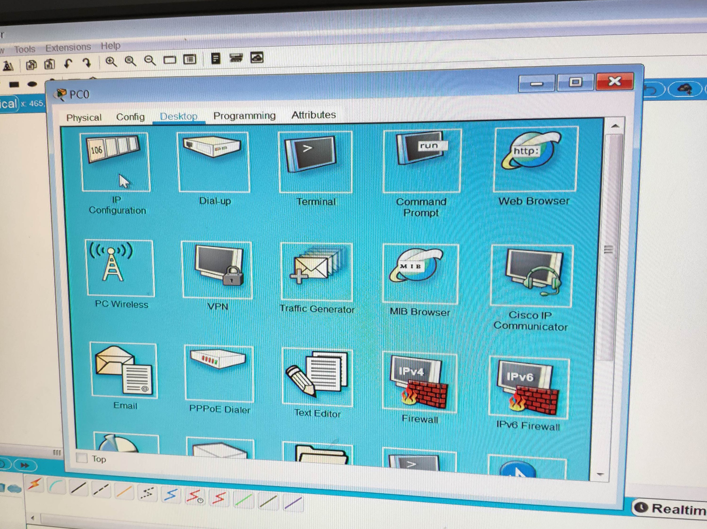

# 計算機網路筆記

## 介紹 cisco packet tracer (9/10)

是一個模擬器可以模擬 cisco 的設備如 switch、router 等

### 安裝 cisco packet tracer

1. 首先到官方網站去下載Packet Tracer  
<http://www.cisco.com/web/learning/netacad/course_catalog/PacketTracer.html>

2. 下載後依照安裝精靈開始安裝
 

3. 安裝完成後啟動 Packet Tracer
 

## 建置一個簡易網路環境

1. 依序點開 PC 設定檔
 

2. 並在 desktop 中的 ip configuration 設定 ip address 以及 subnet mask
 

3. 