# 介紹 cisco packet tracer (9/10)

是一個模擬器可以模擬 cisco 的設備如 switch、router 等

### 安裝 cisco packet tracer

1. 首先到官方網站去下載Packet Tracer <br/>
<http://www.cisco.com/web/learning/netacad/course_catalog/PacketTracer.html>

2. 下載後依照安裝精靈開始安裝
<br/>


3. 安裝完成後啟動 Packet Tracer
<br/>
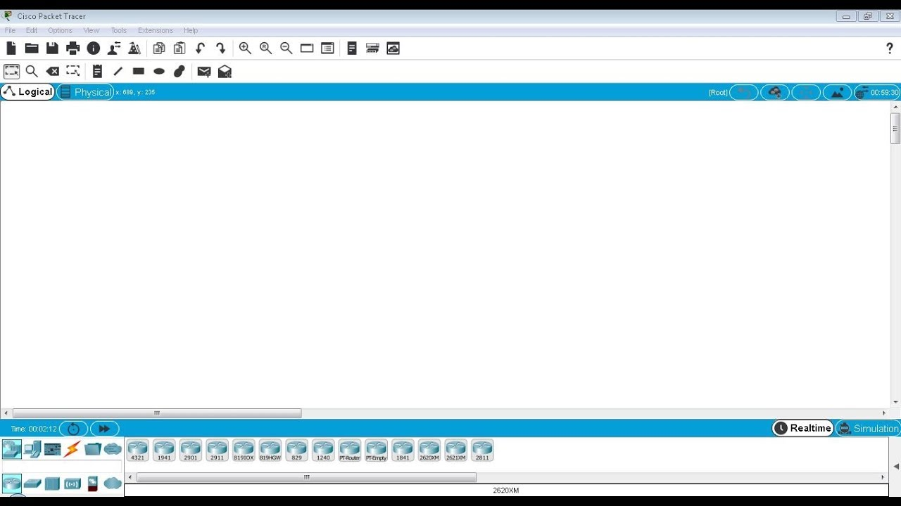

## 建置一個簡易網路環境

1. 依序點開 PC 設定檔
<br/>


2. 在 desktop 中選取 ip configuration
<br/>


3. 設定 ip address 以及 subnet mask，依序新增兩組 ip 為 192.168.1.1/24 及 192.168.1.2/24
<br/>
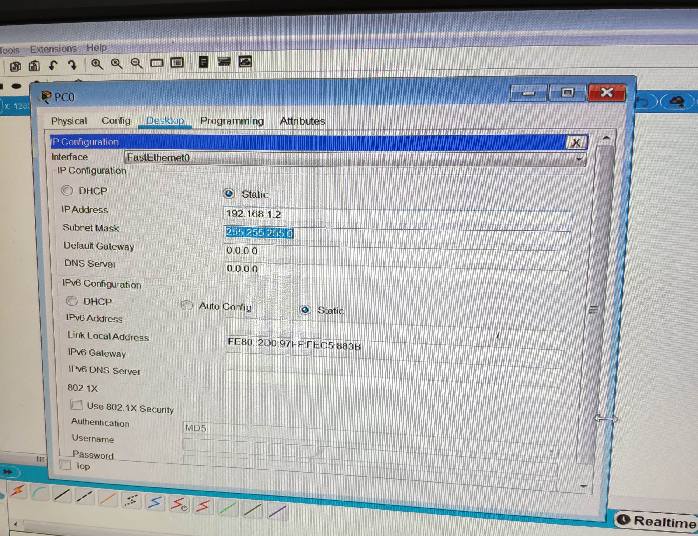

4. 點開其中一台虛擬 PC 在 desktop 中選擇 command prompt，測試 ping 另一台是否成功
<br/>


## router 設定

1. 新增拓樸如下
<br/>


```
Router(config)# hostname R1

R1(config)# interface fastEthernet 0/0
R1(config-if)# ip address 192.168.2.254 255.255.255.0
R1(config-if)# no shutdown
R1(config-if)# exit

R1(config)# int fa1/0
R1(config-if)#  ip address 192.168.1.254 255.255.255.0
R1(config-if)# no shut
R1(config-if)# ip interface brief
```

2. 輸入 ip interface brief 後得到的結果
<br/>


# 介紹線 (9/17)

### cisco console serial USB
Router 或 switch 都有一個 Console Port，下圖為 Console 線
<br/>
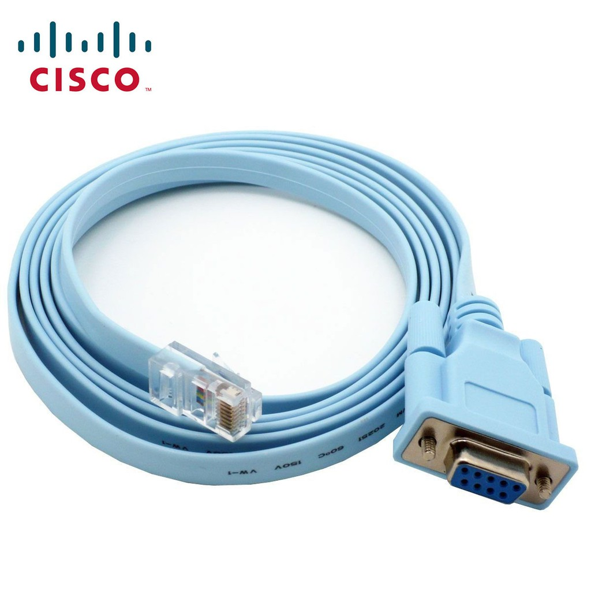

以下為示意圖


### 連線軟體

在 terminal configuration 中設定


使用 PuTTy，與 cisco packet tracer 內的 PC 進行連線

點選 Serial，並設定參數

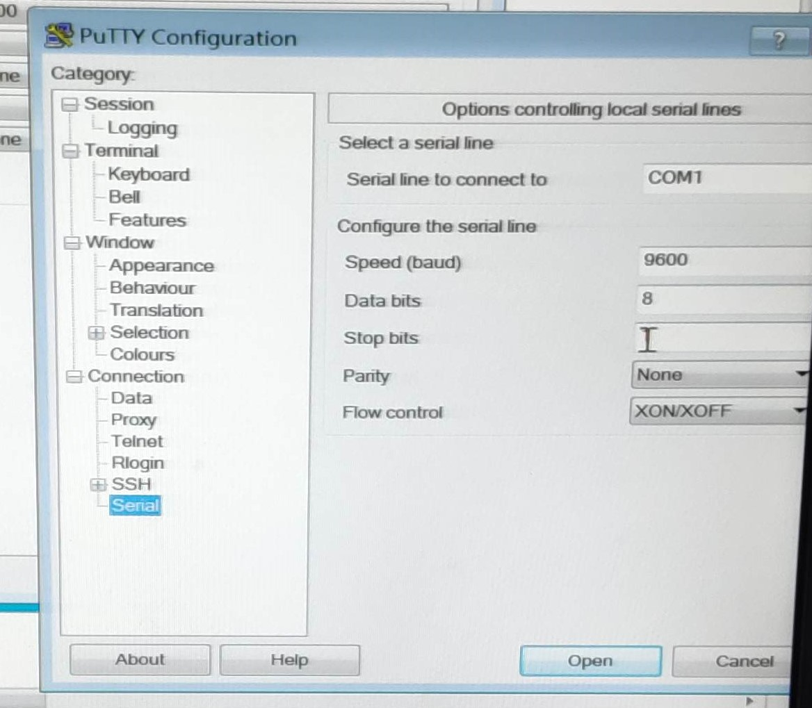


### Cisco 密碼設定

建置兩台 router

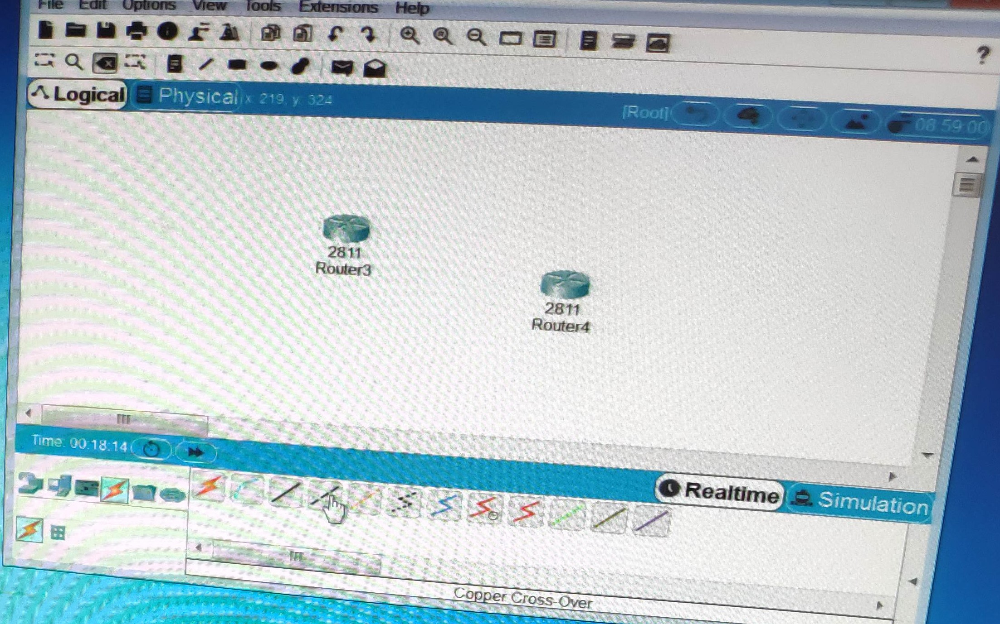

之間用虛線連接，並右鍵開啟 FastEthernet0/0

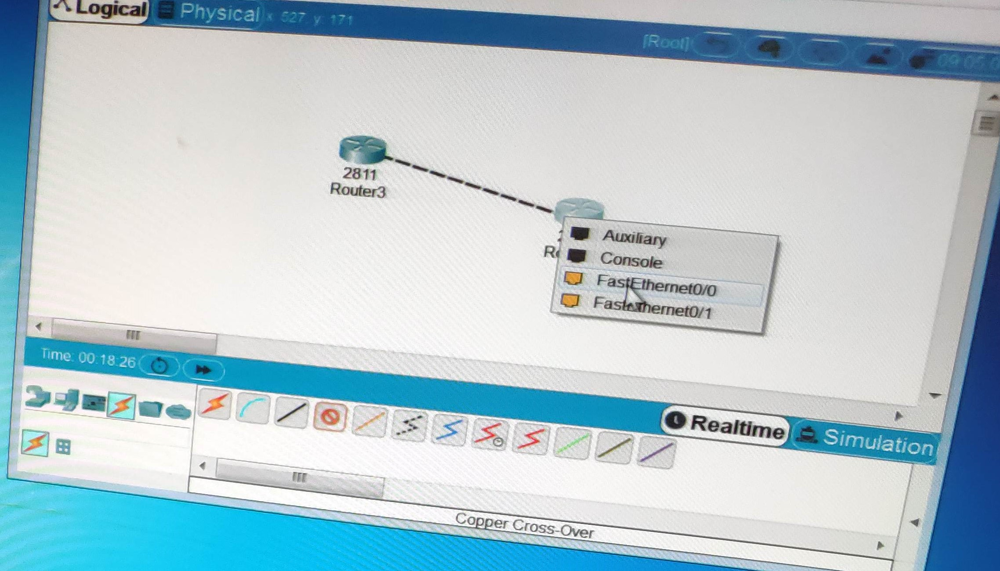

設定登入特權(enable)模式密碼

設定明碼密碼為 cisco
```
(Config)#enable password cisco
```


取消登入特權(enable)模式密碼
```
(Config)#no enable password cisco
```


設定加密密碼為ccnp

```
(Config)#enable secret cisco
```


當明碼(password)和加密(secret)密碼兩者都有設定時優先使用secret之密碼
```
設定遠端登入(Virtual type terminal, vty)密碼

enable模式
(config)#line vty ?                    查看vty可連線數量(系統預設0-15)

(config)#line vty 0 4                  開啟0~4vty連線(即最大連線人數5人)

(config-line)#password ccna            設定密碼為ccna

(config-line)#login                    啟用密碼
```

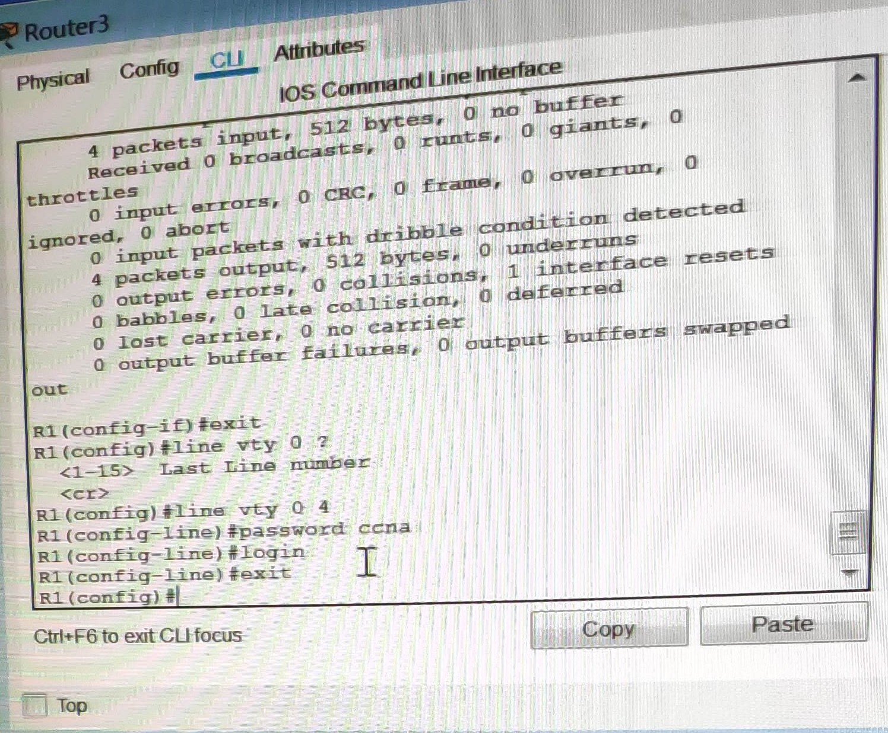

# EVE-NG

到官網下載 OVA 檔<br/>
<https://www.eve-ng.net/index.php/download/>

使用 VMware 開啟


開啟瀏覽器輸入 EVE 指定的 IP，可看到以下登入畫面，並輸入預設帳號密碼登入


點選 new lab 新增檔案後，開啟，可看到空白作業環境，在左上點選加號，新增 Node


選取 cisco IOL 新增設備，加入兩個 nodes，image 使用 L3


將兩台設備連接，並開機，各別雙擊開啟終端機


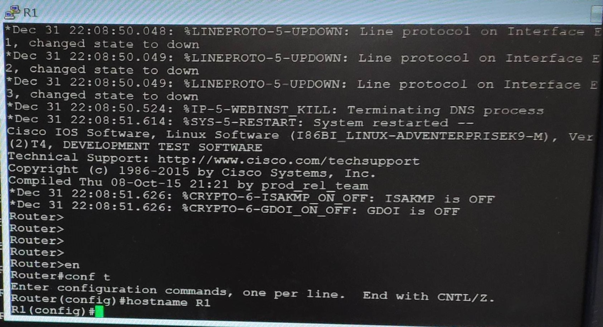

R1 設定
```
Router>
Router> en
Router# conf t
Router(config)# hostname R1
R1(config)# interface e0/0
R1(config-if)# ip addr 12.1.1.1 255.255.255.0
R1(config-if)# no shut
```
R2 設定
```
Router>
Router> en
Router# conf t
Router(config)# hostname R2
R2(config)# interface e0/0
R2(config-if)# ip addr 12.1.1.2 255.255.255.0
R2(config-if)# no shut

R2(config-if)# do ping 12.1.1.1        測試是否連接
```

### tinylinux

進入下列網址，依照網頁步驟逐一完成

<https://www.eve-ng.net/index.php/documentation/howtos/howto-create-own-linux-host-image/>

點擊 Download Linux Images Here，下載tinylinux

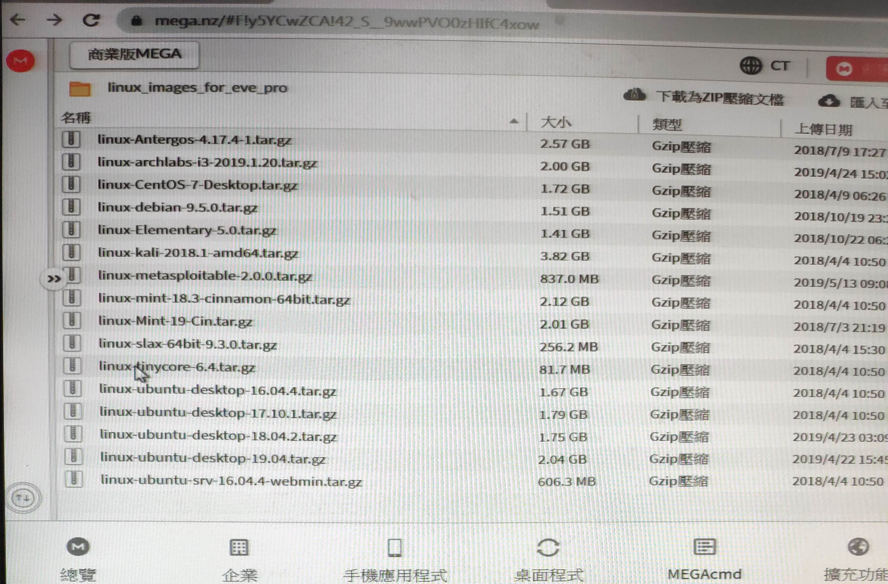

使用 WinSCP 傳輸


步驟皆完成後，進入 EVE-NG 介面並新增節點，選擇Linux

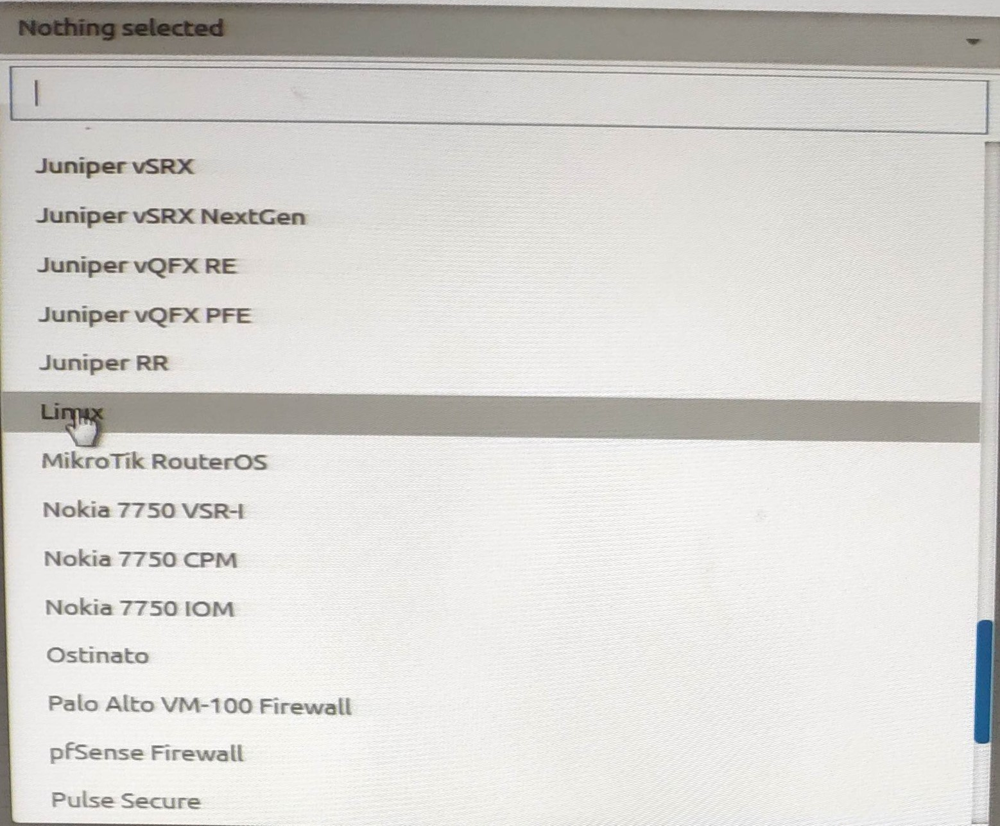

選擇tinylinux


新增 switch 並將三個節點相連

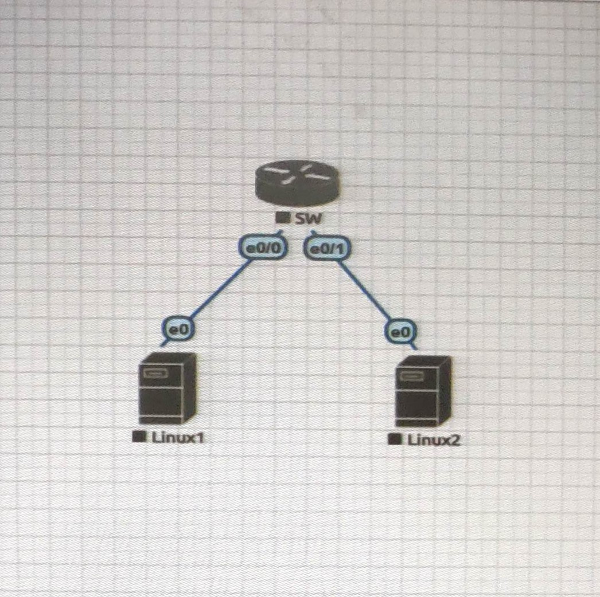

開啟虛擬機的終端機，並加入位址與遮罩


```
su                                 第一台設定
ifconfig eth0 12.1.1.1 netmask 255.255.255.0
ifconfig                           查看設定
```

```
su                                 第二台設定
ifconfig eth0 12.1.1.2 netmask 255.255.255.0
ifconfig                           查看設定
ping 12.1.1.2
```


# 監聽 (9/24)

架設環境如下，一台switch、windows、kali linux、tiny linux

將三台虛擬機 ip 依序設為 192.168.1.1、192.168.1.2、192.168.1.3 ( ip addr add 192.168.1.xxx/24 brd + dev eth0 )

在 kali 中輸入 tcpdump -nni eth0 icmp

tcpdump 可用來擷取通過某網路介面的封包

-nn：直接以 IP 及 port number 顯示，而非主機名與服務名稱

-i：指令要監控的網路介面，如 eth0、lo、any 等

icmp：只抓取 icmp 的封包


* [回上一頁](https://github.com/chullin/Linux/)